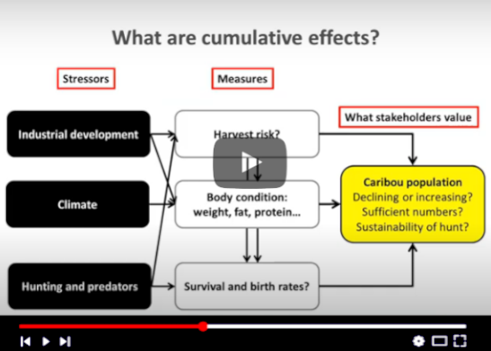

# **Carce** SyncroSim Package

    <a href="https://github.com/ApexRMS/carce">
 
## Evaluating the effects of multiple stressors on caribou
### *Carce* is an open-source SyncroSim Base Package for simulating the cumulative effects of development and climate change on caribou.

To learn more about the **Carce** package, visit [http://www.apexrms.com/cce-barren-ground-caribou/](http://www.apexrms.com/cce-barren-ground-caribou/)

## Requirements

This package requires SyncroSim [version 2.0.42](https://syncrosim.com/download/)

## How to Install

For more information on **Carce**, including how to install, see the [Getting Started](https://apexrms.github.io/carce/getting_started.html) page.

## Links

Browse source code at
[http://github.com/ApexRMS/carce/](http://github.com/ApexRMS/carce/)
 
Report a bug at
[http://github.com/ApexRMS/carce/issues](http://github.com/ApexRMS/carce/issues)

## Developers

Leonardo Frid (Author, maintainer) 
 
Colin Daniel (Author)
 
Alex Embrey (Author)
 
Tom Roe (Author)
 
Robert White (Author)
 
Don Russell (Author)
